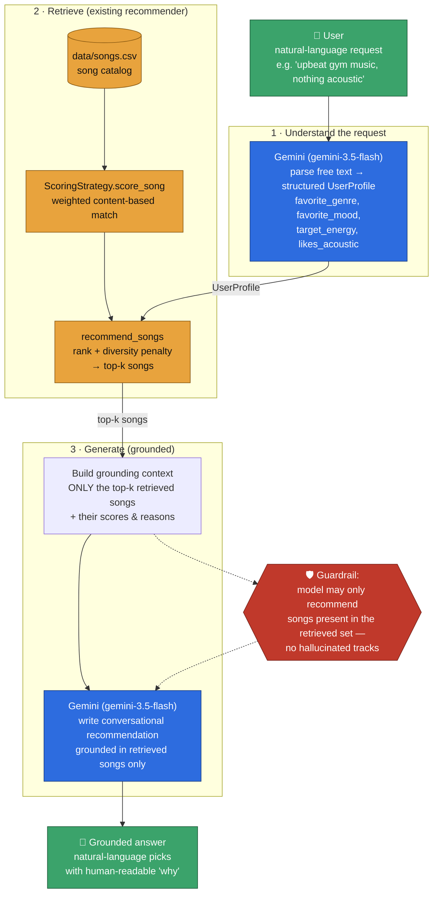

# RAG Architecture — Music Recommender

This document describes the Retrieval-Augmented Generation (RAG) layer that turns
the deterministic content-based recommender into a conversational one. The
implementation lives in [`src/rag.py`](../src/rag.py); the retrieval half reuses
the existing scorer/ranker in [`src/recommender.py`](../src/recommender.py).

## Pipeline

1. **Understand** — Gemini parses a free-text request into a structured `UserProfile`.
2. **Retrieve** — the existing recommender scores + ranks `data/songs.csv` and returns the top-k songs (the grounding data).
3. **Generate** — Gemini writes a conversational recommendation grounded **only** in the retrieved songs, so it can never invent a track outside the catalog.

## Diagram

> Rendered automatically on GitHub. To export locally: `mmdc -i ../diagrams/rag_architecture.mmd -o rag_architecture.svg`
